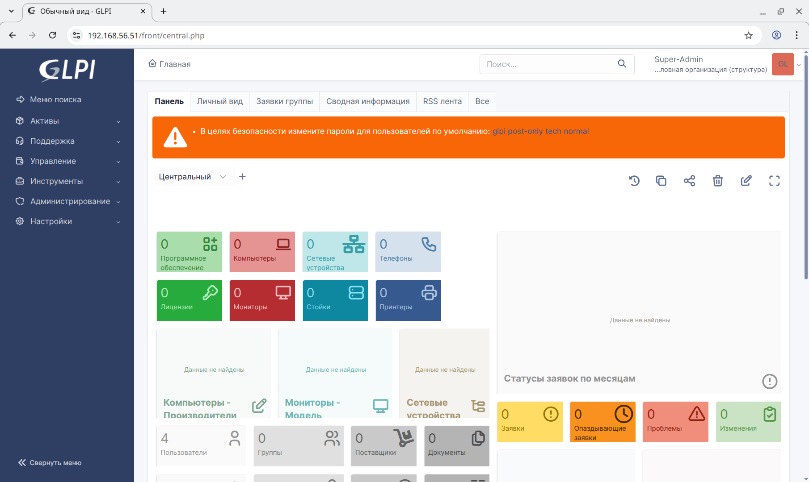

# Настройка конфигурации веб-приложения под высокую нагрузку

## Задание

Используйте **terraform** (или **vagrant**) и **ansible** роли для развертывания серверов веб-приложения под высокую нагрузку и отказоустойчивость.

1. Создать несколько инстансов с помощью **terraform** (2 **angie**, 3 **backend**, 1 **db**).
2. Развернуть **angie** и **keepalived** на серверах **angie** при помощи **ansible**.
3. Развернуть **backend** способный работать по **Uwsgi/Unicorn/PHP-FPM** и базой данных при помощи **Ansible**. Можно взять готовую **CMS** или проект на **Django**.
4. Развернуть **GFS2** для **backend** серверах, для хранения статики.
5. Развернуть СУБД для работы бэкенда при помощи **Ansible**.
6. Проверить отказоустойчивость системы при выходе из строя серверов **backend** или **angie**.

## Реализация

Задание сделано так, чтобы его можно было запустить как в **Vagrant**, так и в **Yandex Cloud**. После запуска происходит развёртывание следующих виртуальных машин:

- **web-iscsi-01** - сервер **iSCSI target**;
- **web-iscsi-02** - сервер **iSCSI target**;
- **web-backend-01** - **GLPI**, клиент файловой системы **GFS2**;
- **web-backend-02** - **GLPI**, клиент файловой системы **GFS2**;
- **web-backend-03** - **GLPI**, клиент файловой системы **GFS2**;
- **web-db-01** - СУБД для работы **GLPI**;
- **web-lb-01** - **angie** балансировщик для **backend**;
- **web-lb-02** - **angie** балансировщик для **backend**.

В независимости от того, как созданы виртуальные машины, для их настройки запускается **Ansible Playbook** [provision.yml](provision.yml) который последовательно запускает следующие роли:

- **wait_connection** - ожидает доступность виртуальных машин.
- **apt_sources** - настраивает репозитории для пакетного менеджера **apt** (используется [mirror.yandex.ru](https://mirror.yandex.ru)).
- **bach_completion** - устанавливает пакет **bash-completion**.
- **chrony** - устанавливает **chrony** для синхронизации времени между узлами.
- **hosts** - прописывает адреса всех узлов в `/etc/hosts`.
- **gen_keys** - генерит `/etc/corosync/authkey` для кластера **corosync**.
- **disk_facts** - собирает информацию о дисках и их сигнатурах (с помощью утилит `lsblk` и `wipefs`).
- **disk_label** - разбивает диски и устанавливает на них **GPT Partition Label** для их дальнейшей идентификации.
- **target** - настраивает сервер **iSCSI Target**.
- **linux_modules** - устанавливает модули ядра (в **Yandex Cloud** стоит **linux-virtual**, который не содержит модулей ядра для работы с **GFS2**).
- **iscsi** - настраивает **iSCSI Initiator**.
- **mpath** - настраивает **multipathd**, в частности прописывает **reservation_key** в `/etc/multipath.conf` для последующего использования в агенте **fence_mpath** для настройки **fencing**'а.
- **corosync** - настраивает кластер **corosync** в несколько колец.
- **dlm** - устанавливает распределённый менеджер блокировок **dlm**.
- **mdadm** - устанавилвает **mdadm** и создаёт **RAID1** массив `/dev/md/cluster-md` (используется технология [MD Cluster](https://docs.kernel.org/driver-api/md/md-cluster.html)).
- **lvm_facts** - с помощью утилит **vgs** и **lvs** собирает информацию о группах и томах **lvm**;
- **lvm** - устанавливает **lvm2**, **lvm2-lockd**, создаёт группы томов, сами логические тома и активирует их.
- **gfs2** - устанавливает **gfs2-utils**.
- **filesystem** - форматирует общий диск в файловую систему **GFS2**.
- **directory** - создаёт пустую директорию `/var/lib/glpi`.
- **pacemaker** - устанавливает и настраивается **pacemaker**, который в свою очередь монтирует файловую систему `/dev/cluster-vg/cluster-lv` в `/var/lib/glpi`.
- **angie** - устанавливает и настраивает **angie**;
- **glpi** - устанавиливает и настраивает **glpi**;
- **mariadb** - устанавиливает и настраивает **mariadb**;
- **mariadb_databases** - создаёт базы данных в **mariadb**;
- **mariadb_timezones** - заполняет таблицу **mysql.time_zone_name**, необходимую для работы **mariadb**;
- **mariadb_users** - создаёт пользователей, для подключения к **mariadb**;
- **php_fpm** - устанавиливает и настраивает **php-fpm**;
- **system_groups** - создаёт группы пользователей в системе (в частности для **glpi**);
- **system_users** - создаёт пользователей в системе (в частности для **glpi**);
- **tls_ca** - создаёт сертификаты для корневых центров сертификации;
- **tls_certs** - создаёт сертификаты для узлов;
- **tls_copy** - копирует серитификаты на узел;
- **keepalived** - устанавливает и настраивает **keepalived** при разворачивании в **vagrant**.

Данные роли настраиваются с помощью переменных, определённых в следующих файлах:

- [group_vars/all/angie.yml](group_vars/all/angie.yml) - общие настройки **angie** для узлов **backend** и **lb**;
- [group_vars/all/ansible.yml](group_vars/all/ansible.yml) - общие переменные **ansible** для всех узлов;
- [group_vars/all/certs.yml](group_vars/all/certs.yml) - настройки генерации сертификатов для СУБД и **angie**;
- [group_vars/all/glpi.yml](group_vars/all/glpi.yml) - общие настройки **GLPI**;
- [group_vars/all/hosts.yml](group_vars/all/hosts.yml) - настройки для роли **hosts** (список узлов, которые нужно добавить в `/etc/hosts`);
- [group_vars/all/iscsi.yml](group_vars/all/iscsi.yml) - общие настройки для **iSCSI Target** и **iSCSI Initiator**;
- [group_vars/backend/angie.yml](group_vars/backend/angie.yml) - настройки **angie** для узлов **backend**;
- [group_vars/backend/certs.yml](group_vars/backend/certs.yml) - настройки генерации сертификатов для **backend**;
- [group_vars/backend/corosync.yml](group_vars/backend/corosync.yml) - настройки **corosync**;
- [group_vars/backend/gfs2.yml](group_vars/backend/gfs2.yml) - настройки **MD Cluster**, **LVM**, **GFS2**;
- [group_vars/backend/glpi.yml](group_vars/backend/glpi.yml) - настройки **GLPI** для **backend**;
- [group_vars/backend/iscsi.yml](group_vars/backend/iscsi.yml) - настройки **iSCSI Initiator**;
- [group_vars/backend/php.yml](group_vars/backend/php.yml) - настройки **PHP** для **backend**;
- [group_vars/backend/users.yml](group_vars/backend/users.yml) - настройки создания пользователей и групп на узлах **backend**;
- [group_vars/db/certs.yml](group_vars/backend/certs.yml) - настройки генерации сертификатов для СУБД;
- [group_vars/db/mariadb.yml](group_vars/backend/mariadb.yml) - настройки **mariadb**;
- [group_vars/iscsi/iscsi.yml](group_vars/iscsi/iscsi.yml) - настройки **iSCSI Target**;
- [group_vars/lb/angie.yml](group_vars/lb/angie.yml) - настройки **angie** для узлов **lb**;
- [group_vars/lb/certs.yml](group_vars/lb/certs.yml) - настройки генерации сертификатов для **lb**;
- [group_vars/lb/keepalived.yml](group_vars/lb/keepalived.yml) - настройки **keepalived** для узлов **lb**;
- [host_vars/web-backend-01/gfs2.yml](host_vars/web-backend-01gfs2.yml) - настройки создания **MD Cluster**, **LVM**, **GFS2**;
- [host_vars/web-backend-01/pacemaker.yml](host_vars/web-backend-01/pacemaker.yml) - настройки **pacemaker**.

## Запуск

### Запуск в Yandex Cloud

1. Необходимо установить и настроить утилиту **yc** по инструкции [Начало работы с интерфейсом командной строки](https://yandex.cloud/ru/docs/cli/quickstart).
2. Необходимо установить **Terraform** по инструкции [Начало работы с Terraform](https://yandex.cloud/ru/docs/tutorials/infrastructure-management/terraform-quickstart).
3. Необходимо установить **Ansible**.
4. Необходимо перейти в папку проекта и запустить скрипт [up.sh](up.sh).

### Запуск в Vagrant (VirtualBox)

Необходимо скачать **VagrantBox** для **bento/ubuntu-24.04** версии **202502.21.0** и добавить его в **Vagrant** под именем **bento/ubuntu-24.04/202502.21.0**. Сделать это можно командами:

```shell
curl -OL https://app.vagrantup.com/bento/boxes/ubuntu-24.04/versions/202502.21.0/providers/virtualbox/amd64/vagrant.box
vagrant box add vagrant.box --name "bento/ubuntu-24.04/202502.21.0"
rm vagrant.box
```

После этого нужно сделать **vagrant up** в папке проекта.

## Проверка

Протестировано в **OpenSUSE Tumbleweed**:

- **Vagrant 2.4.3**
- **VirtualBox 7.1.8_SUSE r168469**
- **Ansible 2.18.4**
- **Python 3.13.2**
- **Jinja2 3.1.6**

После запуска **GLPI** должен открываться по **IP** балансировщика. Для **Yandex Cloud** адрес можно узнать в выводе **terraform** в поле **load_balancer** (смотри [outputs.tf](outputs.tf)). Для **vagrant** это (можно использовать любой адрес):

- [https://192.168.56.51](https://192.168.56.51) - узел **web-lb-01**.
- [https://192.168.56.52](https://192.168.56.52) - узел **web-lb-02**.

Однако **keepalived** настроен таким образом, что при недоступности одного из узлов, оба адреса указывают на один и тот же узел.

Выключим узлы **web-lb-01** и **web-backend-01** и проверим работоспособность:



Как видно оба адреса работают, несмотря на ошибки в логе **angie** на **web-lb-02**:

```txt
2025/04/26 11:53:03 [error] 4831#4831: *135 upstream timed out (110: Connection timed out) while connecting to upstream, client: 192.168.56.1, server: , request: "GET /ajax/dashboard.php?action=get_filter_data&dashboard=central HTTP/2.0", upstream: "https://192.168.56.21:443/ajax/dashboard.php?action=get_filter_data&dashboard=central", host: "192.168.56.52", referrer: "https://192.168.56.52/front/central.php"
2025/04/26 11:56:38 [error] 4831#4831: *234 upstream timed out (110: Connection timed out) while connecting to upstream, client: 192.168.56.1, server: , request: "GET /ajax/dashboard.php?action=get_filter_data&dashboard=central HTTP/2.0", upstream: "https://192.168.56.21:443/ajax/dashboard.php?action=get_filter_data&dashboard=central", host: "192.168.56.51", referrer: "https://192.168.56.51/front/central.php"
```
